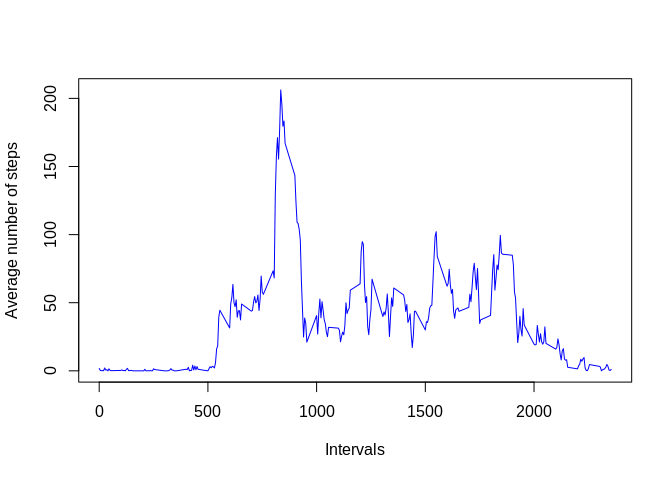

## Loading and preprocessing the data

For reading the file we need to complete two steps:  
1. Unzip the archive to get CSV-file  
2. Read the CSV-file

Next R-code realizes aforementioned steps. To check if result is correct, print result dimensions.


```r
unzip_file <- unzip("activity.zip")
activity <- read.csv(unzip_file)
dim(activity)
```

```
## [1] 17568     3
```

## What is mean total number of steps taken per day?

For this part of the assignment, the missing values in the dataset are ignored.

*activity$date* is a factor, so to compute total number of steps per day *tapply*
can be used. Result will be put to a *steps_total* variable.


```r
steps_total <- tapply(activity$steps, activity$date, sum)
hist(steps_total, xlab = "Steps per day", breaks = 10)
```

<!-- -->

Now when we have total numbers of steps per day for every date in the dataset, we
can count mean and median numbers of steps per day (using r functions).

Mean total number of steps per day:

```r
steps_mean <- mean(steps_total, na.rm = T)
steps_mean
```

```
## [1] 10766.19
```

Median total number of steps per day:

```r
steps_median <- median(steps_total, na.rm = T)
steps_median
```

```
## [1] 10765
```

## What is the average daily activity pattern?

In the original dataset *activity\$interval* is an integer vector. In this case we will need to
use *as.factor* function and then proceed with *split* to subset the original dataset by intervals.


```r
steps_by_interval <- split(activity, as.factor(activity$interval))
intervals <- names(steps_by_interval)
head(intervals)
```

```
## [1] "0"  "5"  "10" "15" "20" "25"
```

Now we can calculate *mean* and *median* of steps in every subset by interval. NA will be ignored.

```r
steps_average_per_interval <- data.frame(interval = rep(0, length(intervals)),
                                         steps = rep(0, length(intervals)),
                                         median_steps = rep(0, length(intervals)))
for (i in 1:length(intervals)){
    steps_average_per_interval[i, 1] <- intervals[i]
    steps_average_per_interval[i, 2] <- mean(steps_by_interval[[i]][['steps']], na.rm = T)
    steps_average_per_interval[i, 3] <- median(steps_by_interval[[i]][['steps']], na.rm = T)
}

plot(steps_average_per_interval$interval, steps_average_per_interval$steps,
     type = 'l', xlab = "Intervals", ylab = "Average number of steps", col = "blue")
```

<!-- -->

At this point we have a data frame that in first column has all intervals and in second
column has corresponding average numbers of steps, so we can find an interval that in average
has the maximum number of steps.

```r
max_index <- which.max(steps_average_per_interval$steps)
max_interval <- steps_average_per_interval[max_index, 1]
max_interval
```

```
## [1] "835"
```

If I understand the logic of coding of intervals correctly, it means that in average the biggest number
of steps person do at interval 8:35 -- 8:40

## Imputing missing values

Calculate number of *NA* in *activity* by columns


```r
# NA number in "date"
na_number <- sum(is.na(activity$date))
na_number
```

```
## [1] 0
```

```r
# NA number in "intervals"
na_number <- sum(is.na(activity$interval))
na_number
```

```
## [1] 0
```

```r
# NA number in "steps"
na_number <- sum(is.na(activity$steps))
na_number
```

```
## [1] 2304
```
As we can see, all missing values are situated in "steps" column.

Like a strategy for replacement of messing values was chosen the next one: every
missing value will be replaced with median for corresponding time interval. This strategy
lets us to ignore some abnormal person behavior.

For the first copy *activity* data frame to a new one and select *steps* coulumn to
some variable for the future usage.

```r
new_activity <- activity
steps <- new_activity$steps
```

Now we can replace every *NA* with corresponding median for interval, that we calculated earlier.

```r
new_steps <- 0
for (i in 1:length(steps)) {
    if (is.na(steps[i])) {
        interval <- new_activity[[i, 3]]
        median_steps <- steps_average_per_interval[steps_average_per_interval$interval == interval, 3]
        steps[i] <- median_steps
        new_steps <- new_steps + median_steps
    }
}
new_activity$steps <- steps
```
Now we can calculate the total number of steps per day for new data frame like we did before for
original one, and draw histogram for both results at one plot (old one -- blue color, new one -- red color).

```r
steps_total_new <- tapply(new_activity$steps, new_activity$date, sum)

hist(steps_total, xlab = "Steps per day", col = rgb(0, 0, 1, 0.25), breaks = 10)
hist(steps_total_new, col = rgb(1, 0, 0, 0.25), add = T, breaks = 10)
```

<!-- -->

Calculate *mean* and *median* for new dataset.


```r
steps_mean_new <- mean(steps_total_new)
steps_mean_new
```

```
## [1] 9503.869
```

```r
steps_median_new <- median(steps_total_new)
steps_median_new
```

```
## [1] 10395
```

As we can see, adding missing values to dataset slightly reduce average and median number of steps
per day.

Total step difference (just count all steps that I add in new dataset)

```r
new_steps
```

```
## [1] 9128
```

## Are there differences in activity patterns between weekdays and weekends?

For every raw in the new dataset add factor variable weekday

```r
weekend <- c("Saturday", "Sunday")
new_activity$weekend <- factor(rep("weekday", length(new_activity$date)), levels = c("weekday", "weekend"))
for (i in 1:length(new_activity$date)){
  new_activity[[i, 4]] <- ifelse(weekdays(as.Date(new_activity[[i, 2]])) %in% weekend, "weekend", "weekday")
}
```
Split *new_activity* on two data frames by *new_activity$weekend*

```r
splited_new_activity <- split(new_activity, new_activity$weekend)

weekday_activity <- as.data.frame(splited_new_activity$weekday)
weekend_activity <- as.data.frame(splited_new_activity$weekend)
```
Now for both data frames we can calculate average number of steps using *tapply*
and draw plots

```r
weekend_mean <- tapply(weekend_activity$steps, as.factor(weekend_activity$interval), mean)
weekday_mean <- tapply(weekday_activity$steps, as.factor(weekday_activity$interval), mean)

# par(mfcol = c(2, 1))
# par(fig = c(0, 0.7, 0, 0.7), new = T)
par(mfcol = c(2, 1))
plot(names(weekend_mean), weekend_mean, xlab = "Intervals",
     ylab = "Steps (weekends)", type = "l", col = "red",
     ylim = c(0, 200))
plot(names(weekday_mean), weekday_mean, xlab = "Intervals",
     ylab = "Steps (weekdays)", type = "l", col = "blue",
     ylim = c(0, 200))
```

<!-- -->
